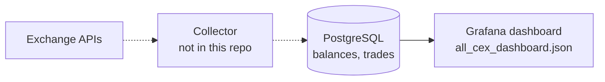

# Exchange account monitoring dashboard (PostgreSQL + Grafana)

A Grafana dashboard for monitoring trading accounts across centralized exchanges. It reads balance snapshots and executed trades from PostgreSQL and shows balances, trade notional, fees and trade history per exchange, subaccount and trading pair.

This repository contains the **consumption layer only**: the dashboard definition (`all_cex_dashboard.json`). The collector that pulls balances and trades from exchange APIs is not included.


## Data flow



## Panels

| Panel | Query logic |
|---|---|
| Base / Quote token balance | Balance time series for each side of the selected pair (`split_part(symbol, '/', 1 or 2)`) |
| Total trades | `COUNT(*)` of trades in the time range |
| Total fees | Sum of fees; fees not in USDT/USDC are converted with the trade price |
| Trade volume | Notional per trade (`price * quantity`) |
| Trade history | Latest trades: time, side, price, quantity, fee |

Template variables `exchange`, `subaccount` (multi-select) and `symbol` are populated from the tables with `SELECT DISTINCT`, so new exchanges and pairs appear automatically.

## Expected schema

The dashboard queries need at least these columns. The DDL below is a minimal compatible schema derived from the queries, not the original production schema:

```sql
CREATE TABLE balances (
    time        TIMESTAMPTZ NOT NULL,
    exchange    TEXT        NOT NULL,
    subaccount  TEXT        NOT NULL,
    token       TEXT        NOT NULL,   -- e.g. ETH
    balance     NUMERIC     NOT NULL
);

CREATE TABLE trades (
    time        TIMESTAMPTZ NOT NULL,
    exchange    TEXT        NOT NULL,
    subaccount  TEXT        NOT NULL,
    symbol      TEXT        NOT NULL,   -- e.g. ETH/USDT
    side        TEXT        NOT NULL,   -- buy / sell
    price       NUMERIC     NOT NULL,
    quantity    NUMERIC     NOT NULL,
    fee         NUMERIC,
    fee_token   TEXT
);
```

## Setup

1. Create the tables above (or point Grafana at existing tables with the same columns).
2. In Grafana 11+, add a PostgreSQL data source named **`PostgreSQL`** — the panels reference the data source by this name.
3. Import `all_cex_dashboard.json` (Dashboards → New → Import).

## Limitations

- Fee conversion assumes that a fee not paid in USDT/USDC is paid in the base token. Fees paid in a third token (e.g. an exchange token) are converted incorrectly.
- "Trade volume" plots per-trade notional, not volume aggregated over a time interval.
- No PnL calculation.
- No collector, sample data or provisioning files in the repo yet.
